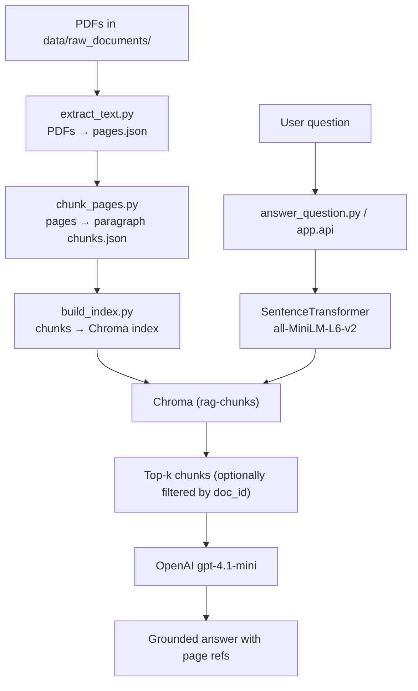

# AI Document Intelligence – RAG over SAMK Guidance Handbook

An end-to-end Retrieval-Augmented Generation (RAG) system that answers questions about  multiple SAMK-related PDFs:

- **Student guidance and counselling at Satakunta University of Applied Sciences**
- **Admissions Criteria, Spring 2025**
- **Erasmus+ Policy / Internationalisation**

The goal is to learn how real-world AI systems are built in practice:
- ingest documents,
- chunk them into meaningful units,
- build a vector index,
- retrieve relevant context,
- let an LLM generate grounded answers with page references.

This is an applied AI / data engineering project, not a model training project.

---

## Features

- **Multi-document support**
  - Ingests all PDFs in `data/raw_documents/`
  - Each chunk tagged with `doc_id`, `title`, `page`, etc.
  - Optional `doc_id` filter for “answer only from this document”

- **Ingestion**
  - `pypdf` → page-level JSON (`pages.json`)
  - Keeps metadata: `doc_id`, `title`, `page`, `source`, `char_count`

- **Paragraph-aware chunking**
  - Splits pages into paragraphs (blank-line separated)
  - Groups paragraphs into chunks up to ~800 characters
  - Preserves `char_start` / `char_end` offsets per page

- **Semantic search**
  - Embeddings via `sentence-transformers` (`all-MiniLM-L6-v2`)
  - Local persistent vector DB with **Chroma**
  - Noise filtering (reference lists, ISBN/ISSN/DOI/URL-heavy, very short text)

- **RAG-style Q&A**
  - CLI tool: `app/answer_question.py`
  - LLM: `gpt-4.1-mini` via OpenAI Responses API
  - Uses top-k chunks as context, with doc + page references
  - Refuses to answer if context doesn’t contain the answer

- **API**
  - FastAPI app in `app/api.py`
  - `POST /ask` endpoint for programmatic access
  - Optional `doc_id` and `top_k` in request body

- **Debugging tools**
  - `vector_store/retrieve.py` – inspect raw top-k retrieved chunks
  - `eval/manual_eval.md` – manual evaluation of answer quality

---

## Architecture

### High-level flow


## Dataset

This project uses three documents:

- **samk_student_guidance**
Student guidance and counselling at Satakunta University of Applied Sciences

- **samk_admissions_2025**
Admissions Criteria, Spring 2025

- **samk_erasmus_policy**
Erasmus+ policy / internationalisation at SAMK

**Important**:
The PDFs are not included in this repository due to copyright.
You can download them (or equivalent SAMK publications) and place them in:

`data/raw_documents/`

## Project Structure
```bash
ai-document-intelligence-rag/
├── app/
│   ├── __init__.py
│   ├── answer_question.py   # CLI RAG Q&A
│   └── api.py               # FastAPI app
│
├── data/
│   ├── raw_documents/       # PDF goes here (only local)
│   └── processed/
│       ├── pages.json       # output of extract_text.py
│       └── chunks.json      # output of chunk_pages.py
│
├── eval/
│   └── manual_eval.md       # manual evaluation notes
│
├── ingestion/
│   ├── extract_text.py      # PDF → pages.json
│   └── chunk_pages.py       # pages.json → chunks.json
│
├── vector_store/
│   ├── build_index.py       # chunks.json → Chroma index
│   └── retrieve.py          # debug: inspect top-k chunks
│
├── .gitignore
├── README.md
└── requirements.txt
```

## Setup

### 1. Clone and create a virtual environment
```bash
git clone <your-repo-url> ai-document-intelligence-rag
cd ai-document-intelligence-rag

python -m venv venv-ai-doc-intel
source venv-ai-doc-intel/bin/activate

pip install --upgrade pip
pip install -r requirements.txt
```

### 2. Configure API key

Create a .env file in the project root:
```bash
OPENAI_API_KEY=your_api_key_here
```

### 3. Place the PDF

Download the SAMK guidance handbook PDF from Theseus and save it as:
```bash
data/raw_documents/samk_student_guidance.pdf
```

## Usage

### 1. Ingest the document
```bash
# Extract page-level text
python ingestion/extract_text.py

# Chunk pages into overlapping text windows
python ingestion/chunk_pages.py
```

This will produce:
- data/processed/pages.json
- data/processed/chunks.json

### 2. Build the vector index
```bash
python vector_store/build_index.py
```

This will:
- filter noisy chunks (references, ISBN/ISSN/DOI, URL-heavy, very short text),
- embed each remaining chunk with all-MiniLM-L6-v2,
- store embeddings + metadata in a persistent Chroma collection under vector_store/chroma.

### 3. Inspect raw retrieval (optional)
```bash
python vector_store/retrieve.py
```

You can type a question and see which chunks are retrieved, with:
- rank
- distance
- page number
- chunk text snippet

Useful for debugging retrieval quality.

### 4. Ask questions via CLI (RAG)
Basic usage (search across all documents):
```bash
python app/answer_question.py "How does SAMK use Erasmus+ to support internationalisation?"
```

Scope to a single document with --doc-id:
```bash
# Guidance handbook only
python app/answer_question.py \
  "What is the objective of this handbook?" \
  --doc-id samk_student_guidance

# Admissions criteria only
python app/answer_question.py \
  "What are the selection methods for the Data Engineering degree programme?" \
  --doc-id samk_admissions_2025

# Erasmus+ policy only
python app/answer_question.py \
  "How does SAMK use Erasmus+ to support internationalisation?" \
  --doc-id samk_erasmus_policy
```

The script will:

- embed the question,
- retrieve top-k relevant chunks from Chroma (optionally filtered by `doc_id`),
- build a grounded prompt (with doc + page refs),
- call `gpt-4.1-mini`,
- print a concise answer.

If the answer is **not** in the context, it explicitly says it cannot find it in the documents.

### 5. Ask questions via FastAPI

Start the API server:
```bash
uvicorn app.api:app --reload
```

Then open the interactive docs:
- http://127.0.0.1:8000/docs

Example request body for POST /ask:
```json
{
  "question": "What are the selection methods for the Data Engineering degree programme?",
  "top_k": 5,
  "doc_id": "samk_admissions_2025"
}
```
Or across all documents:
```json
{
  "question": "How does SAMK support students at the beginning of their studies?",
  "top_k": 5
}
```

## Evaluation

Manual evaluation is recorded in:
```bash
eval/manual_eval.md
```

It includes:

- questions per document,
- short summaries of the answers,
- verdicts (good / ok / bad),
- notes on retrieval + answer quality,
- a negative test (out-of-scope question → model correctly says “not in docs”).

## Limitations and Possible Future Work

Current limitations:

- Only a **small set of PDFs** (SAMK-focused).
- No **reranking step** beyond basic vector similarity.
- No **automated evaluation** – only manual checks.
- The API is minimal, and there is no separate web UI yet.

Potential improvements:

- Sentence-level chunking or hybrid sentence+paragraph strategy.
- Reranking using a cross-encoder or LLM.
- Support for tagging / grouping documents by topic or audience.
- Simple web UI (Streamlit or small frontend) on top of the FastAPI backend.
- More systematic evaluation with a larger question set.

Milestones

- **v1** – single-PDF RAG
    - One handbook, fixed-size character chunks, local Chroma, CLI retrieval.

- **v2** – multi-doc, paragraph-aware RAG
    - Multiple SAMK PDFs, paragraph-based chunks, doc-scoped retrieval, grounded LLM answers, FastAPI endpoint, and manual evaluation.

## Tech Stack

- Language: **Python 3.12**
- Ingestion: **pypdf**
- Embeddings: **sentence-transformers** (all-MiniLM-L6-v2)
- Vector DB: **Chroma** (persistent, local)
- LLM: **OpenAI gpt-4.1-mini**
- API: **FastAPI + Uvicorn**
- Env: `venv-ai-doc-intel`