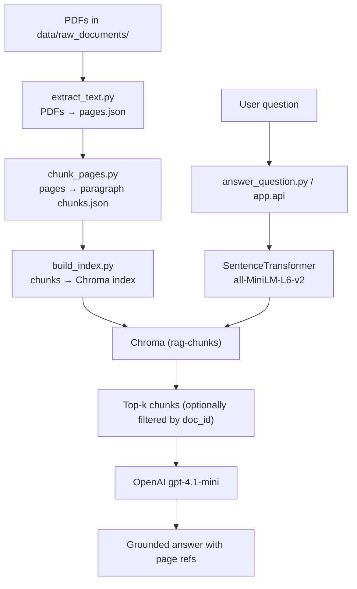

# AI Document Intelligence – RAG over SAMK Guidance Handbook

An end-to-end Retrieval-Augmented Generation (RAG) system that answers questions about  multiple SAMK-related PDFs:

- **Student guidance and counselling at Satakunta University of Applied Sciences**
- **Admissions Criteria, Spring 2025**
- **Erasmus+ Policy / Internationalisation**

The goal is to learn how real-world AI systems are built in practice:
- ingest documents,
- chunk them into meaningful units,
- build a vector index,
- retrieve relevant context,
- let an LLM generate grounded answers with page references.

This is an applied AI / data engineering project, not a model training project.

---

## Features

- **Multi-document support**
  - Ingests all PDFs in `data/raw_documents/`
  - Each chunk tagged with `doc_id`, `title`, `page`, etc.
  - Optional `doc_id` filter for “answer only from this document”

- **Ingestion**
  - `pypdf` → page-level JSON (`pages.json`)
  - Keeps metadata: `doc_id`, `title`, `page`, `source`, `char_count`

- **Paragraph-aware chunking**
  - Splits pages into paragraphs (blank-line separated)
  - Groups paragraphs into chunks up to ~800 characters
  - Preserves `char_start` / `char_end` offsets per page

- **Semantic search**
  - Embeddings via `sentence-transformers` (`all-MiniLM-L6-v2`)
  - Local persistent vector DB with **Chroma**
  - Noise filtering (reference lists, ISBN/ISSN/DOI/URL-heavy, very short text)

- **RAG-style Q&A**
  - CLI tool: `app/answer_question.py`
  - LLM: `gpt-4.1-mini` via OpenAI Responses API
  - Uses top-k chunks as context, with doc + page references
  - Refuses to answer if context doesn’t contain the answer

- **API**
  - FastAPI app in `app/api.py`
  - `POST /ask` endpoint for programmatic access
  - Optional `doc_id` and `top_k` in request body

- **Debugging tools**
  - `vector_store/retrieve.py` – inspect raw top-k retrieved chunks
  - `eval/manual_eval.md` – manual evaluation of answer quality

---

## Architecture

### High-level flow


## Dataset

This project uses three documents:

- **samk_student_guidance**
Student guidance and counselling at Satakunta University of Applied Sciences

- **samk_admissions_2025**
Admissions Criteria, Spring 2025

- **samk_erasmus_policy**
Erasmus+ policy / internationalisation at SAMK

**Important**:
The PDFs are not included in this repository due to copyright.
You can download them (or equivalent SAMK publications) and place them in:

`data/raw_documents/`

## Project Structure
```bash
ai-document-intelligence-rag/
├── app/
│   ├── __init__.py
│   ├── answer_question.py   # CLI RAG Q&A
│   └── api.py               # FastAPI app
│
├── data/
│   ├── raw_documents/       # PDF goes here (only local)
│   └── processed/
│       ├── pages.json       # output of extract_text.py
│       └── chunks.json      # output of chunk_pages.py
│
├── eval/
│   └── manual_eval.md       # manual evaluation notes
│
├── ingestion/
│   ├── extract_text.py      # PDF → pages.json
│   └── chunk_pages.py       # pages.json → chunks.json
│
├── vector_store/
│   ├── build_index.py       # chunks.json → Chroma index
│   └── retrieve.py          # debug: inspect top-k chunks
│
├── .gitignore
├── README.md
└── requirements.txt
```

## Setup

### 1. Clone and create a virtual environment
```bash
git clone <your-repo-url> ai-document-intelligence-rag
cd ai-document-intelligence-rag

python -m venv venv-ai-doc-intel
source venv-ai-doc-intel/bin/activate

pip install --upgrade pip
pip install -r requirements.txt
```

### 2. Configure API key

Create a .env file in the project root:
```bash
OPENAI_API_KEY=your_api_key_here
```

### 3. Place the PDF

Download the SAMK guidance handbook PDF from Theseus and save it as:
```bash
data/raw_documents/samk_student_guidance.pdf
```

## Usage

### 1. Ingest the document
```bash
# Extract page-level text
python ingestion/extract_text.py

# Chunk pages into overlapping text windows
python ingestion/chunk_pages.py
```

This will produce:
- data/processed/pages.json
- data/processed/chunks.json

### 2. Build the vector index
```bash
python vector_store/build_index.py
```

This will:
- filter noisy chunks (references, ISBN/ISSN/DOI, URL-heavy, very short text),
- embed each remaining chunk with all-MiniLM-L6-v2,
- store embeddings + metadata in a persistent Chroma collection under vector_store/chroma.

### 3. Inspect raw retrieval (optional)
```bash
python vector_store/retrieve.py
```

You can type a question and see which chunks are retrieved, with:
- rank
- distance
- page number
- chunk text snippet

Useful for debugging retrieval quality.

### 4. Ask questions via CLI (RAG)
```bash
python app/answer_question.py "What is the objective of this handbook?"

#OR

python app/answer_question.py
# then type your question when prompted
```

This will:
- embed the question,
- retrieve top-k chunks from Chroma,
- build a prompt with page references,
- call OpenAI gpt-4.1-mini,
- and print a grounded answer.

### 5. Ask questions via FastAPI

Start the API server:
```bash
uvicorn app.api:app --reload
```

Then open the interactive docs:
- http://127.0.0.1:8000/docs

Example request (curl):
```bash
curl -X POST "http://127.0.0.1:8000/ask" \
  -H "Content-Type: application/json" \
  -d '{"question": "Who is this publication intended for?", "top_k": 5}'
```

## Evaluation

Manual evaluation is recorded in:
```bash
eval/manual_eval.md
```

Examples:

- Question: “Who is this publication intended for?”
 Answer correctly identifies guidance / counselling staff at SAMK and students.

- Question: “What is the objective of this handbook?”
 Answer matches the stated aim: introduce the background of guidance and counselling, support and harmonise practices, and provide tools.

Some more open or abstract questions produce partial or generalized answers, which is expected for this first version.

## Limitations and Possible Future Work

- Only a single PDF is indexed.
- Chunking is character-based with overlap, not sentence- or paragraph-aware.
- No reranking step beyond basic vector similarity.
- Evaluation is manual and small-scale.

Possible future improvements:

- Sentence- or paragraph-aware chunking.
- Reranking of top-k chunks with a cross-encoder or LLM.
- Support for multiple documents and collections.
- Simple web UI on top of the FastAPI backend.
- More systematic evaluation with a larger question set.

## Tech Stack

- Language: Python 3.12
- Ingestion: pypdf
- Embeddings: sentence-transformers (all-MiniLM-L6-v2)
- Vector DB: chromadb (persistent, local)
- LLM: OpenAI gpt-4.1-mini
- API: FastAPI + Uvicorn
- Env: venv-ai-doc-intel